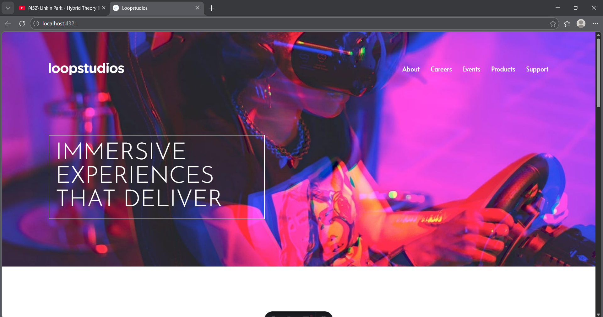

# 🏝️ Proyecto: Loopstudios Landing Page

Este proyecto consiste en el desarrollo de la **landing page de Loopstudios** utilizando **Astro** y **Tailwind CSS**.  
El objetivo es aplicar los conocimientos sobre **componentes de Astro**, **maquetación**, **estilos responsivos** y **utilidades CSS** para construir un diseño limpio, moderno y adaptable a diferentes dispositivos.

---

## 📖 Descripción general

### 🧩 Vista previa del proyecto



---

### 🔗 Enlaces del proyecto

- **Repositorio en GitHub:** [URL del repositorio](https://github.com/AngelGab1012/loopstudioslandingpage_programacionweb)
- **Sitio desplegado (opcional):** [Vercel](https://loopstudioslandingpage-programacion.vercel.app/)

---

## 🧠 Proceso de desarrollo

### 🛠️ Tecnologías utilizadas

- [Astro](https://astro.build)
- [Tailwind CSS](https://tailwindcss.com/)
- HTML5 semántico
- CSS
- Diseño responsivo (Mobile-first)
- Componentes de Astro reutilizables
- Interacciones con JavaScript

---

### 💡 Lo que aprendí

En este proyecto aprendí a estructurar de mejor manera proyectos utilizando el framework **Astro,** reforcé mis conocimientos en Tailwind y aprendí propiedades nuevas **relative** y **group** que aplique para el diseño del componente **CreationsImages.**

Además en este proyecto me ayudo a comprender de mejor manera el lenguaje **JavaScript** el cual me ayudo a no repetir el mismo pedazo de código varias veces en ciertas partes de algunos componentes como en **Navbar** y **Footer,** así como ayudarme a agregar funcionalidad al proyecto en el componente **Navbar** para el menú en dispositivos móviles.

Fragmentos de Código:

```js
<ul class="hidden gap-7 md:flex">
  { navPages.map((page) => (
    <li>
      <a href={ page.href }
      class="text-white pb-1 hover:border-b-2 hover:border-white">
        { page.name }
      </a>
    </li>
  ))}
</ul>
```

```js
menubtn?.addEventListener('click', () => {
  hamburger?.classList.toggle('hidden');
  close?.classList.toggle('hidden');
  menu?.classList.toggle('hidden');
  document.body.classList.toggle('overflow-hidden');
});
```

---

### 🚀 Áreas de mejora

- Mejorar el manejo del responsive en pantallas pequeñas.  
- Mejorar el uso de Tailwind.   
- Optimizar la estructura del proyecto y el uso de componentes.
- Practicar y mejorar mis conocimientos de **JavaScript**

---

### 📚 Recursos útiles

- [Documentación de Astro](https://docs.astro.build)  
- [Guía oficial de Tailwind CSS](https://tailwindcss.com/docs)  
- [Tailwind CSS classes](https://tailwind.build/classes)
- [Astro Quick Start Course | Build an SSR Blog](https://youtu.be/XoIHKO6AkoM?si=aBwPAL3yEpCWtdeM)

---

### 👩‍💻 Autor

- **Nombre completo: Angel Gabriel Palacios Medina**  
- **Carrera: Ing. TICs**  
- **Grupo: AEB1055 TC1**  
- **Correo institucional: 23151226@aguascalientes.tecnm.mx**  

---

### ✨ Reflexión final

- ¿Qué fue lo más fácil o lo más difícil de realizar? 
Lo más fácil de realizar fue la estructuración del proyecto (layout, componentes, index) y lo más difícil fue realizar el **Navbar** responsivo para móviles junto con la sección de **Creations.**

- ¿Qué parte disfrutaste más del desarrollo? 
Ver que todo el proyecto funcionaba y era responsivo para todas las medidas de display (Móviles (S) -> Laptop (L)).

- ¿Qué conceptos nuevos aprendiste?  
Las propiedades **relative** y **group.**

- ¿Cómo aplicarías lo aprendido en proyectos futuros?
Este proyecto me ayudo a mejorar la forma en que estructuro los proyectos, además de ayudarme a practicar Tailwind, ya que se me dificulta encontrar la clase que necesito aplicar. Lo anterior me ayudaría en proyectos futuros en la organización y diseño, así mismo este proyecto me ayudo a practicar y comprender de mejor manera la implementación de **JavaScript,** lo cual me ayudara a implementar este lenguaje en proyectos futuros cuando sea necesario.
 
